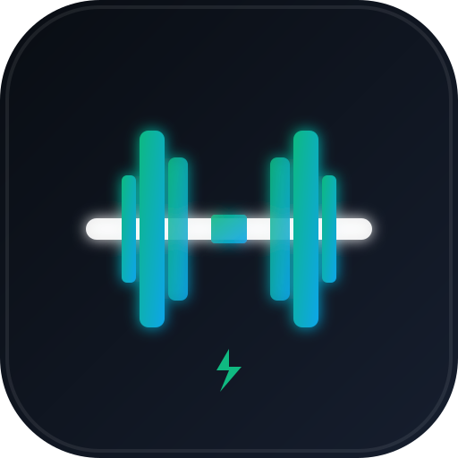

# Gym Tracker PWA 🏋️‍♂️

A sleek, offline-first Progressive Web App (PWA) designed for frictionless strength training tracking in the gym. Built with zero cloud dependencies, instant local persistence, and a mobile-first touch UI.



---

## ✨ Highlights & Features

### ⚡ 100% Offline-First & Privacy-Focused
- **No registration, no accounts, no subscriptions, no tracking.**
- All workout routines, custom exercises, and workout history are stored locally on your device in **IndexedDB**.
- Full PWA Service Worker caching: loads instantly even with zero gym signal or in airplane mode.
- Persistent Storage API integration to prevent browser eviction.

### ⏱ Active Workout Session Mode
- **Live Elapsed Timer**: Tracks total workout duration.
- **Touch-Optimized Steppers**: Quick weight steppers (`-5`, `-2.5`, `+1`, `+2.5`, `+5 kg`) and rep steppers so you never have to fight on-screen software keyboards with sweaty hands.
- **Set Types**: Cycle between Normal (**NORM**), Warmup (**W**), Dropset (**D**), and Failure (**F**). Warmup sets are automatically excluded from total volume tonnage.
- **Smart Rest Timer**:
  - Auto-triggers upon completing a set.
  - Quick-adjust buttons (`-15s`, `+30s`, `Next Set ➔`, `Skip ✕`).
  - Multi-sensory completion alert using the **Web Audio API** (synthesized dual-tone chime) and **Vibration API**.
- **Screen Wake Lock API**: Keeps your phone screen awake during workouts so you never have to unlock it between sets.
- **Crash & Reload Resilience**: Active session state is continuously saved in IndexedDB. If your browser closes or page refreshes, your workout resumes seamlessly.
- **Undo Protection**: 5-second snackbar notification allows undoing accidental set completions.
- **Ghost Data (Previous Performance)**: Automatically displays your previous weight and reps directly beneath each exercise.
- **Adaptive Overload (Auto-Update Template)**: Option to automatically update your base workout routine with your new weights upon finishing a session.

### 📋 Custom Routine Builder & Default Workouts
- Build custom routines with custom exercises, default rest periods, and exercise-specific notes (e.g., grip type, bench angle, machine pin position).
- Reorder exercises easily with `▲ / ▼` buttons.
- Exercise search & autocomplete that remembers your frequently used movements.
- **Preloaded Workouts** (`src/data/default_workouts.json`):
  1. **Day 1 (Chest / Triceps)**
  2. **Day 2 (Back / Biceps)**
  3. **Day 3 (Legs / Shoulders)**
  4. **Day 3 — Upper Body B + 🔥 HIIT Finisher #1**

### 📊 History & Analytics
- Overview cards: **Total Volume (kg / tonnes)**, **Total Workouts Completed**, and **Average Duration**.
- Detailed historical workout logs with timestamp, duration, total reps, and tonnage.
- Collapsible workout snapshot view to inspect every exercise, set, weight, and note.

### 💾 Backup, Restore & PC Template Sync
- **JSON Export & Import**: One-click export and import to transfer workout history and programs between devices.
- **PC Template Reload**: Sync newly added workout templates from `default_workouts.json` directly from the Settings menu.

---

## 🛠 Tech Stack

- **Core**: Vanilla TypeScript (strict mode)
- **Styling**: Modern CSS3 (HSL color tokens, dark glassmorphism, responsive grid & flexbox, zero CSS frameworks)
- **Bundler**: Vite 6
- **Database**: IndexedDB via [`idb`](https://github.com/jakearchibald/idb)
- **APIs**:
  - Service Worker Cache API (PWA)
  - Web Audio API (synthesized chime feedback)
  - Navigator Vibration API
  - Screen Wake Lock API
  - StorageManager Persistence API

---

## 🚀 Getting Started

### Prerequisites
- Node.js 18+ installed on your machine.

### Installation
```bash
# Clone repository
git clone https://github.com/Svitovan/gym-tracker.git
cd gym-tracker

# Install dependencies
npm install
```

### Development
Start the local development server:
```bash
npm run dev
```
The application will be accessible at `http://localhost:3000/`.

### Production Build
Compile TypeScript and build the production bundle:
```bash
npm run build
```
Preview the production build locally:
```bash
npm run preview
```

---

## 📱 Running on Your Phone (Local Network)

To run and install the app on your mobile phone on your local Wi-Fi network:

1. Run the dev server with network exposure:
   ```bash
   npm run dev -- --host 0.0.0.0 --port 3000
   ```
2. Find your PC's local IP address (e.g. `192.168.1.xxx` via `ipconfig` on Windows or `ifconfig` on macOS/Linux).
3. Open `http://<YOUR_PC_IP>:3000/` in Safari (iOS) or Chrome (Android) on your phone.
4. **Install as PWA**:
   - **iOS Safari**: Tap the **Share** button (⎋) at the bottom and choose **Add to Home Screen** (+).
   - **Android Chrome**: Tap the **⋮** menu and choose **Install app** or tap the install prompt in the app Settings.

---

## 📁 Project Structure

```
gym-tracker/
├── index.html                   # Entry HTML with PWA meta headers
├── public/
│   ├── icon.svg                 # App vector icon
│   ├── manifest.json            # PWA Web App Manifest
│   └── sw.js                    # Offline Service Worker cache
├── src/
│   ├── components/
│   │   ├── Header.ts            # Top bar and status indicators
│   │   ├── SettingsModal.ts     # Backup, restore & template sync dialog
│   │   ├── Toast.ts             # Non-intrusive notification toasts
│   │   ├── WorkoutEditor.ts     # Routine builder and editor view
│   │   ├── WorkoutHistoryView.ts# Analytics and workout history logs
│   │   ├── WorkoutList.ts       # Workouts home feed and active session card
│   │   └── WorkoutSession.ts    # Active workout mode, rest timer & steppers
│   ├── data/
│   │   └── default_workouts.json# Built-in workout templates
│   ├── db/
│   │   └── index.ts             # IndexedDB schemas, CRUD operations & migrations
│   ├── services/
│   │   ├── backup.ts            # JSON import/export & storage diagnostic helpers
│   │   ├── feedback.ts          # Multi-sensory sound & vibration triggers
│   │   ├── sound.ts             # Web Audio API chime generator
│   │   └── wakeLock.ts          # Screen Wake Lock API wrapper
│   ├── styles/
│   │   ├── builder.css          # Routine editor & stepper styles
│   │   ├── history.css          # Analytics cards & history accordion styles
│   │   ├── main.css             # Design system, dark palette & global styles
│   │   └── session.css          # Active session, rest timer & modal styles
│   ├── types/
│   │   └── workout.ts           # TypeScript interfaces for workouts, sets & logs
│   └── main.ts                  # Router, view switcher & PWA initialization
├── package.json
├── tsconfig.json
└── vite.config.ts
```

---

## 📄 License

This project is licensed under the [MIT License](LICENSE).
